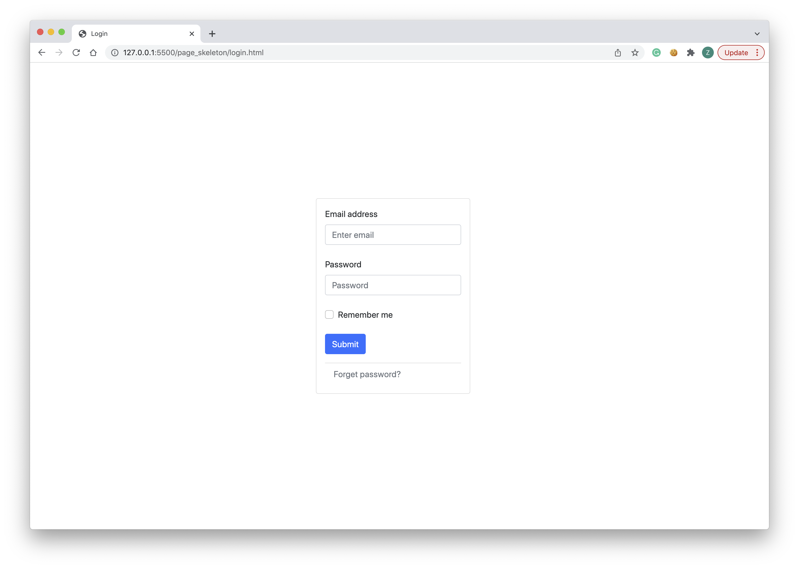
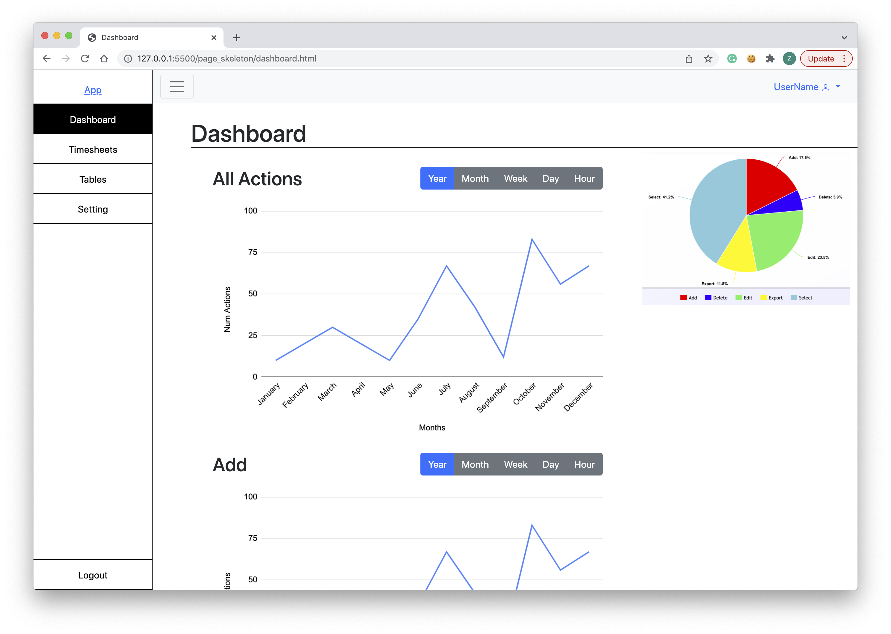
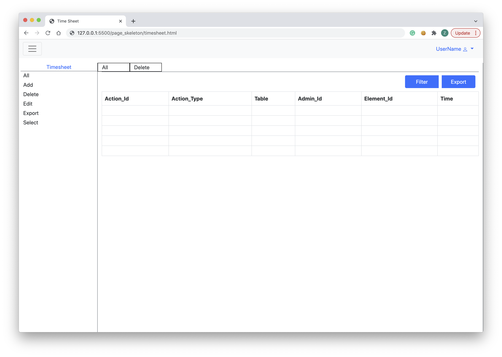
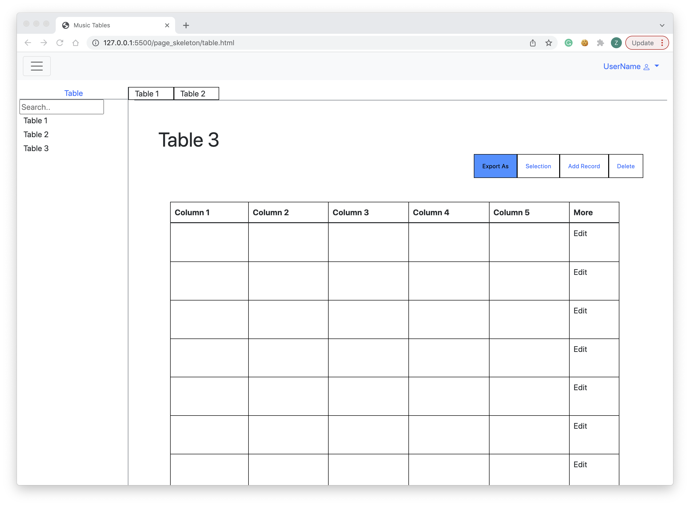
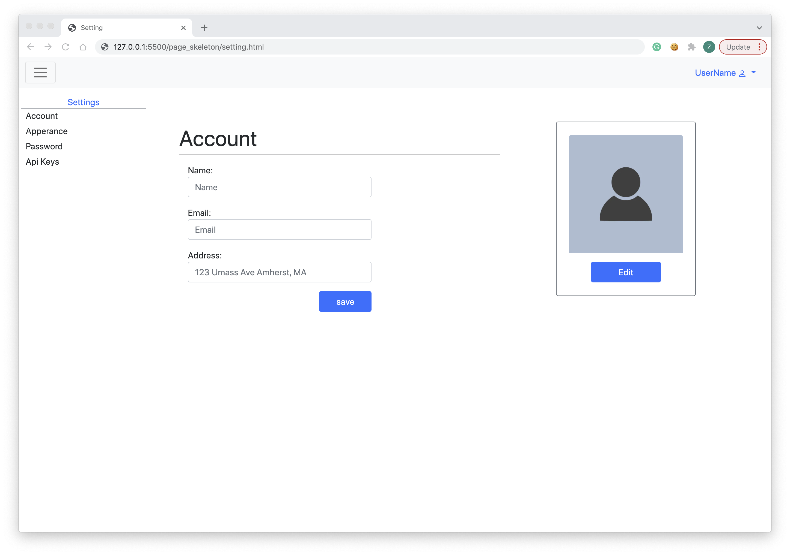

# Group 22 - Copycat
## Admin Portal for Music Data Management

 

### Team Overview
Team Members | GitHub Usernames
-------------|-----------------
Linhao He 	 |	linhaohe
Zetang Lei	 |	zetangL
Shipeng He	 |	HereAndPeng
Nghia Pham   |  minhnghia2208

 

### Data Interactions
Our project will be focusing on building a data management web application for an existing music player. The potential users of this application are admins, data engineers, and user support. The web application will display the data from the SQL database; the data consists of individual artists, playlists, songs, song cover images, and genre. After the data is displayed, the user is able to add, edit, and delete from the corresponding database. The user is also able to perform actions such as filtering, sorting, and exporting on the current grid through the web application. Each of the user’s actions will be recorded and time-stamped, so the user can tell when it a given action is performed. All action data will also be displayed to the user in forms of graphs and charts, for the purpose of better understanding user activities over a given period of time.

### WireFrame
[Link to Entire WireFrame](https://github.com/linhaohe/cs326-final-copycat/blob/main/docs/copycat_wireframe.jpg)

### HTML and CSS

#### Login Page:
Contributor: Linhao He
 
Screenshot:

This is the login page of the web application. The user must login before granted access to the rest of the web app.

 
 

#### Dashboard:
Contributor: Zetang Lei
 
Screenshot:

This is the main page of the web application. 
The sidebar will have links to every page the user want to access on the web app. It is togglable to show/hide with the hamburger menu button on the top left corner of the page.  
The main page content is the dashboard. It shows all types of actions the user has done on the web application. The types of actions are categorized into 5 different main sections: Add, Delete, Edit, Export, and Select/Search. There will be several activity graphs on the dashboard that shows the amount of actions the user has done in a given time period and the types of actions they did. The user could select to see the number of actions they did in the past year, past month, past week, etc. by clicking on the appropriate button.

 
 

#### Timesheets:
Contributor: Nghia (Keith) Pham
 
Screenshot:

In this page, the user can see the timestamps of each action any admins had done previously, including themselves. Similar to the data presented in the dashboard, the data are separated into 5 different main sections. The user could select onto one of the tabs on the right to view specifically the timesheet data of that action. The data in this page would be much more specific than those presented on the dashboard with specific timestamps and which user performed which actions.

 
 

#### Music Tables:
Contributor: Shipeng He
 
Screenshot:

This page presents the main purpose of this web application. On the left sidebar, there are a list of tables that the current admin user can manage. When they click onto a table, it would open up the table the in main screen. There, they can perform various actions such as filtering or editing the data in the table.

 
 

#### Setting:
Contributor: Linhao He
 
Screenshot:

In this page, the user can change their profile information such as changing their personal info, profile picture, password, and other settings.
