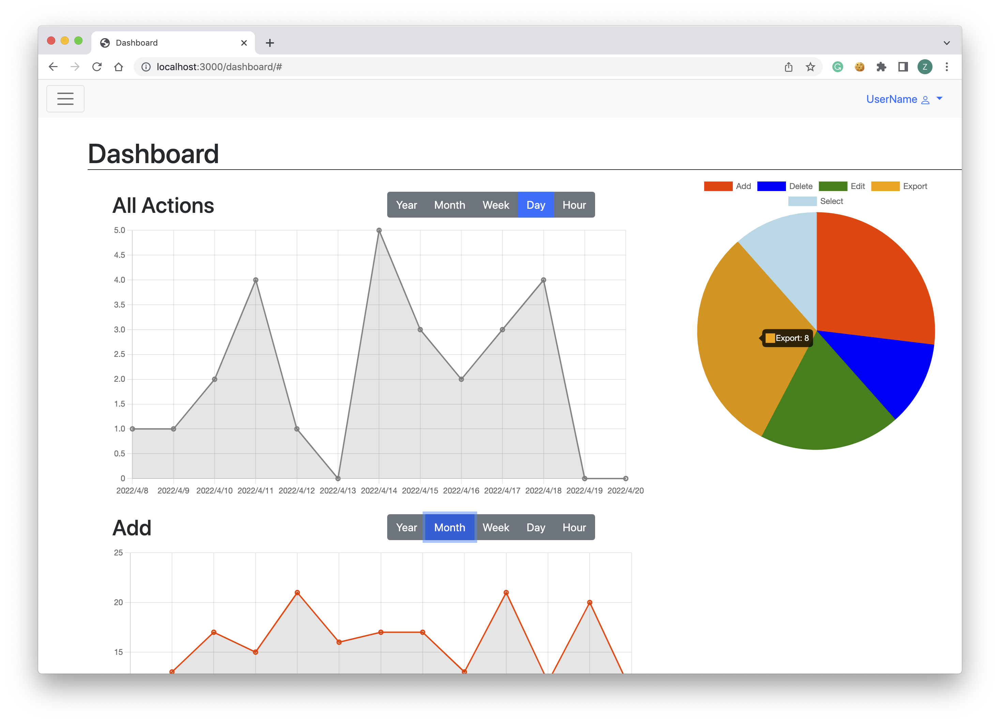

# Group 22 - Copycat
## Admin Portal for Music Data Management

 

### Team Overview
Team Members | GitHub Usernames
-------------|-----------------
Linhao He 	 |	linhaohe
Zetang Lei	 |	zetangL
Shipeng He	 |	HereAndPeng
Nghia Pham   |  minhnghia2208

### Part 0: Project API Planning
+ Dashboard:
	+ GET activity datetimes of a given activityTypes for a given time frame 
		+ activityType can be ‘all’, ‘add’, ‘delete’, ‘edit’, ‘export’, or ‘select’
		+ timeFrom and timeTo are JSON.stringified versions of js Date objects
		+ Example request: /activities?activityType=add&timeFrom=”2010-04-20T02:05:25.706Z”&timeTo=”2022-04-20T02:05:25.706Z”
		+ Example result: 
		{
			‘add’: [ 2012-09-13T15:27:23.000Z,
				2016-04-29T11:42:57.000Z,
					2020-04-27T18:16:19.000Z,
					2017-09-01T08:26:07.000Z,
					2021-08-13T13:16:49.000Z, …]
		}

+ TimeSheet:
	+ GET /timesheet/all
		+ Call this endpoint to get all actions made by all admins
		+ Response: 200 
		[{ 
		“action_id”: “1”,
		“action_type”: “add”, 
		“table”: “???”, 
		“admin_id: “1”, 
		“element_id”: “1”, 
		“time”: UTCtime
		}, …]
	+ GET /timesheet/add
		+ Call this endpoint to get add actions made by all admins
		Response: 200 
		[{ 
		“action_id”: “1”,
		“action_type”: “add”, 
		“table”: “???”, 
		“admin_id: “1”, 
		“element_id”: “1”, 
		“time”: UTCtime
		}, …]
	+ GET /timesheet/delete
		+ Call this endpoint to get delete actions made by all admins
		Response: 200 
		[{ 
		“action_id”: “2”,
		“action_type”: “delete”, 
		“table”: “???”, 
		“admin_id: “1”, 
		“element_id”: “20”, 
		“time”: UTCtime
		}, …]
	+ GET /timesheet/edit
		+ Call this endpoint to get edit actions made by all admins
		+ Response: 200 
		[{ 
		“action_id”: “3”,
		“action_type”: "edit, 
		“table”: “???”, 
		“admin_id: “1”, 
		“element_id”: “13”, 
		“time”: UTCtime
		}, …]
	+ GET /timesheet/export
		+ Call this endpoint to get export actions made by all admins
		+ Response: 200 
		[{ 
		“action_id”: “4”,
		“action_type”: “export”, 
		“table”: “???”, 
		“admin_id: “1”, 
		“element_id”: “14”, 
		“time”: UTCtime
		}, …]
	+ GET /timesheet/select
		+ Call this endpoint to get select actions made by all admins
		+ Response: 200 
		[{ 
		“action_id”: “5”,
		“action_type”: “select”, 
		“table”: “???”, 
		“admin_id: “1”, 
		“element_id”: “25”, 
		“time”: UTCtime
		}, …]

+ 

### Part 3: Front-end Implementation
#### CREATE

  

#### READ
Screenshot:

The CRUD action shown here is READ. The data that is displayed on the graphs are read from the server through crud requests. Then the data is sorted and rendered into the graphs shown on the dashboard where the data points belong.

  

#### UPDATE

  

#### DELETE

