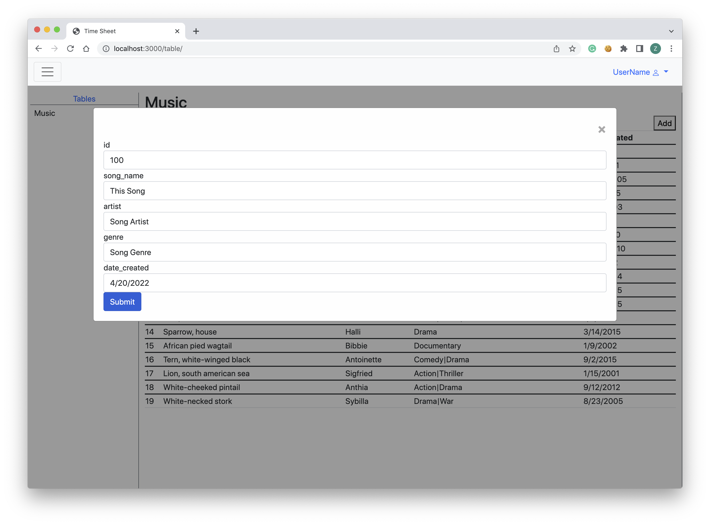
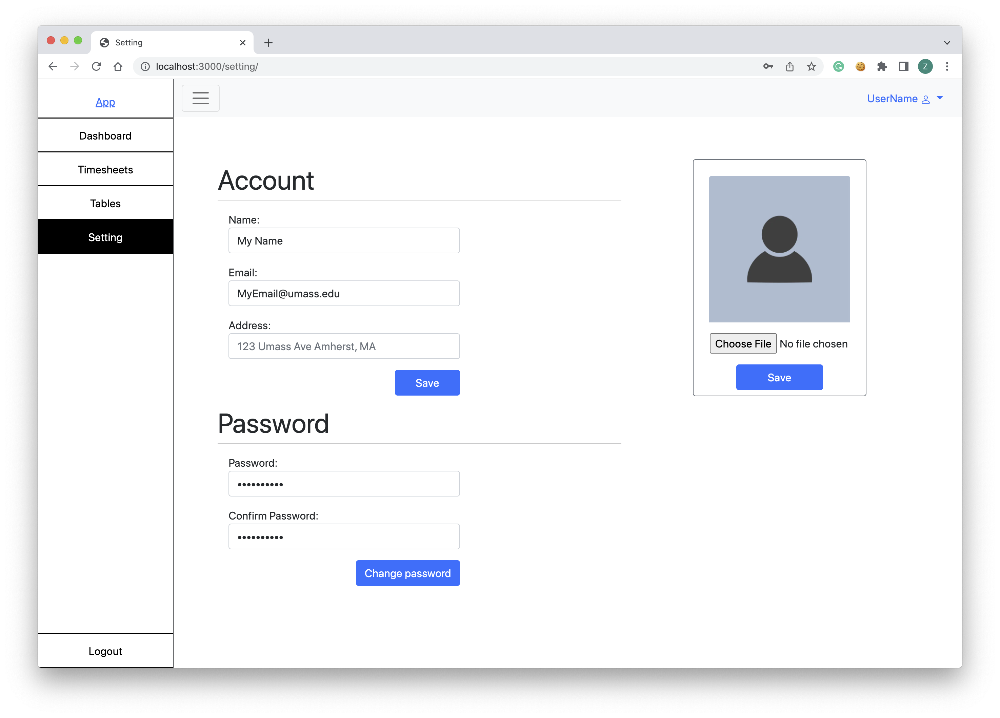
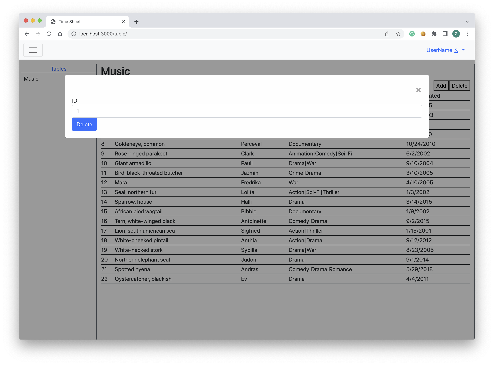

# Group 22 - Copycat
## Admin Portal for Music Data Management

 

### Team Overview
Team Members | GitHub Usernames
-------------|-----------------
Linhao He 	 |	linhaohe
Zetang Lei	 |	zetangL
Shipeng He	 |	HereAndPeng
Nghia Pham   |  minhnghia2208

 

Link to hosted site on Heroku: [Admin Portal Login](https://cs-326-copycat.herokuapp.com/)  
Access [Web App Dashboard](https://cs-326-copycat.herokuapp.com/dashboard/) for the actual site since login authentication was not implemented for milestone 2.
 

### Part 0: Project API Planning
+ Dashboard:
	+ GET activity datetimes of a given activityTypes for a given time frame 
		+ activityType can be ‘all’, ‘add’, ‘delete’, ‘edit’, ‘export’, or ‘select’
		+ timeFrom and timeTo are JSON.stringified versions of js Date objects
		+ Example request: /activities?activityType=add&timeFrom=”2010-04-20T02:05:25.706Z”&timeTo=”2022-04-20T02:05:25.706Z”
		+ Example result: 
		{
			‘add’: [ 2012-09-13T15:27:23.000Z,
				2016-04-29T11:42:57.000Z,
					2020-04-27T18:16:19.000Z,
					2017-09-01T08:26:07.000Z,
					2021-08-13T13:16:49.000Z, …]
		}

+ TimeSheet:
	+ GET /timesheet/all
		+ Call this endpoint to get all actions made by all admins
		+ Response: 200 
		[{ 
		“action_id”: “1”,
		“action_type”: “add”, 
		“table”: “???”, 
		“admin_id: “1”, 
		“element_id”: “1”, 
		“time”: UTCtime
		}, …]
	+ GET /timesheet/add
		+ Call this endpoint to get add actions made by all admins
		Response: 200 
		[{ 
		“action_id”: “1”,
		“action_type”: “add”, 
		“table”: “???”, 
		“admin_id: “1”, 
		“element_id”: “1”, 
		“time”: UTCtime
		}, …]
	+ GET /timesheet/delete
		+ Call this endpoint to get delete actions made by all admins
		Response: 200 
		[{ 
		“action_id”: “2”,
		“action_type”: “delete”, 
		“table”: “???”, 
		“admin_id: “1”, 
		“element_id”: “20”, 
		“time”: UTCtime
		}, …]
	+ GET /timesheet/edit
		+ Call this endpoint to get edit actions made by all admins
		+ Response: 200 
		[{ 
		“action_id”: “3”,
		“action_type”: "edit, 
		“table”: “???”, 
		“admin_id: “1”, 
		“element_id”: “13”, 
		“time”: UTCtime
		}, …]
	+ GET /timesheet/export
		+ Call this endpoint to get export actions made by all admins
		+ Response: 200 
		[{ 
		“action_id”: “4”,
		“action_type”: “export”, 
		“table”: “???”, 
		“admin_id: “1”, 
		“element_id”: “14”, 
		“time”: UTCtime
		}, …]
	+ GET /timesheet/select
		+ Call this endpoint to get select actions made by all admins
		+ Response: 200 
		[{ 
		“action_id”: “5”,
		“action_type”: “select”, 
		“table”: “???”, 
		“admin_id: “1”, 
		“element_id”: “25”, 
		“time”: UTCtime
		}, …]

+ Tables
	+ POST /createMusicEntry
		+ Creates a music entry in the music table with the given info
		+ Example: /createMusicEntry
		body = {song_name:"song", artist:"artist", genre:"music_genre", date_created:"2010/1/1"}
		+ Example Response: Status 200
		{id: 123, song_name:"song", artist:"artist", genre:"music_genre", date_created:"2010/1/1"}
	+ GET /music?limit=10
		+ Response: Status 200
		[{...}]an array of JSONs of music data of length less than or equal to the given limit
	+ PUT /music/update?song_name="songName"&artist="artistName"&genre="genre"
		+ Updates the genre of the given song by that given artist
		+ Response status 200 if success, or status 404 if not found
	+ DELETE /music/delete?song_name="songName"&artist="artistName
		+ Deletes the given song by that given artist
		+ Response status 200 if success, or status 404 if not found

+ Settings
	+ PUT /account/user_id/profileImage
		+ body: {img: imgurl}
		+ Saves the profile image for the given user
		+ Response 200 on saving image successfully
	+ PUT /account/user_id/profilePassword
		+ body: {password: password}
		+ Saves the password for the given user
		+ Response 200 on saving password successfully

### Part 3: Front-end Implementation
#### CREATE
  
The CRUD action shown here is CREATE. A music entry is being created.

  

#### READ
Screenshot:
  
The CRUD action shown here is READ. The data that is displayed on the graphs are read from the server through crud requests. Then the data is sorted and rendered into the graphs shown on the dashboard where the data points belong.

  

#### UPDATE
  
The CRUD action shown here is update. The user informations such as name, email, and address can be updated by entering in the information and clicking the save button. It will trigger a PUT request to the server which will save the updated user profile information. There is also similar update actions done when changing the password and the user profile image.

  

#### DELETE
  
The CRUD action shown here is DELETE. A music entry is being deleted from the music table. This triggers a delete request to the server that would permanently delete the music entry given the song name and artist name.

  
  

##  Division of Labor
Settings Page: Linhao He  
Dashboard: Zetang Lei  
Timesheet: Nghia Pham  
Tables Page Endpoints: Shipeng He  
Tables Page Frontend render: Linhao He  
Fake Database Functions: Zetang Lei  
