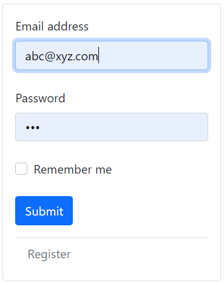
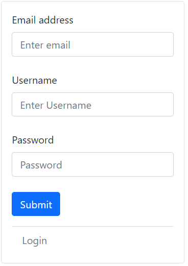
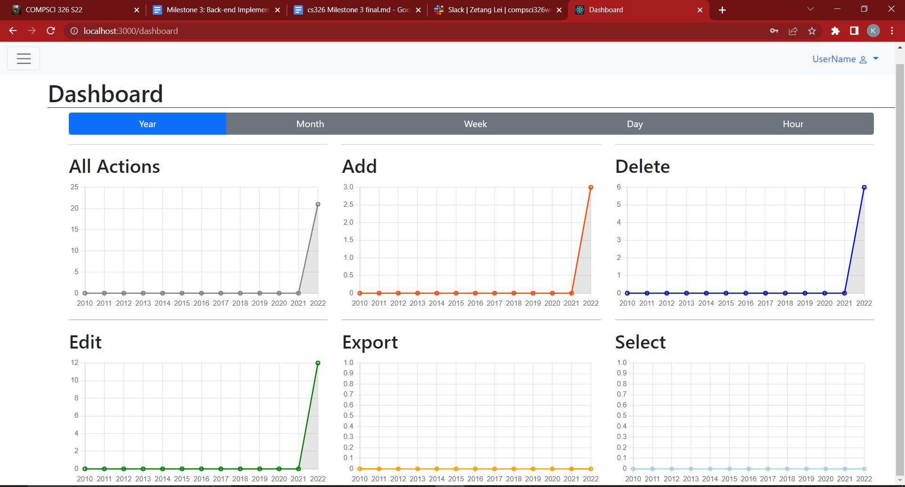
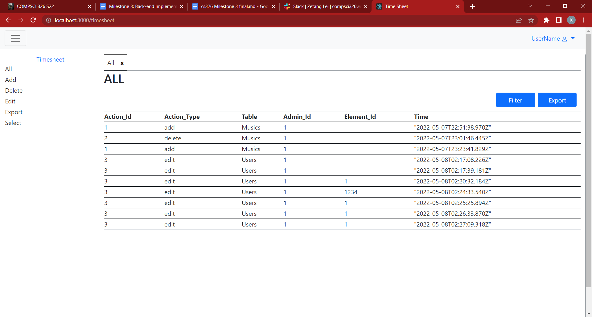
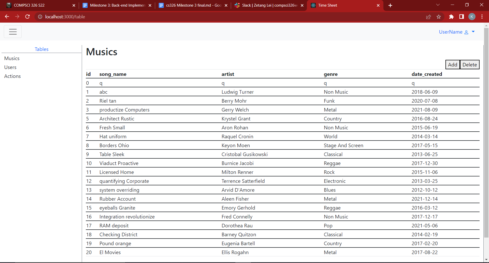
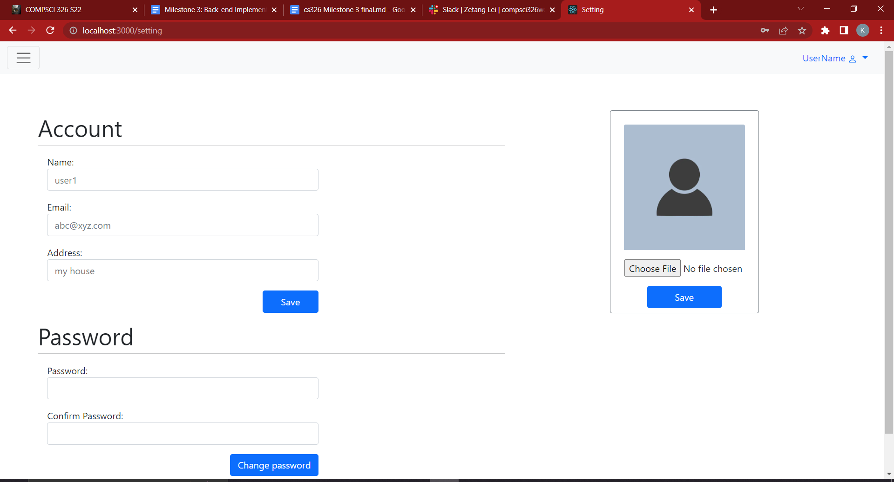
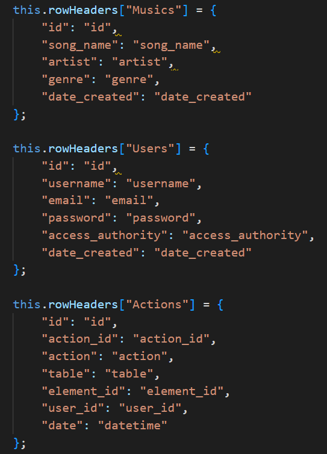
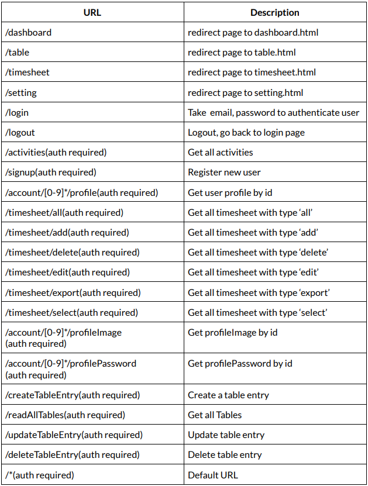
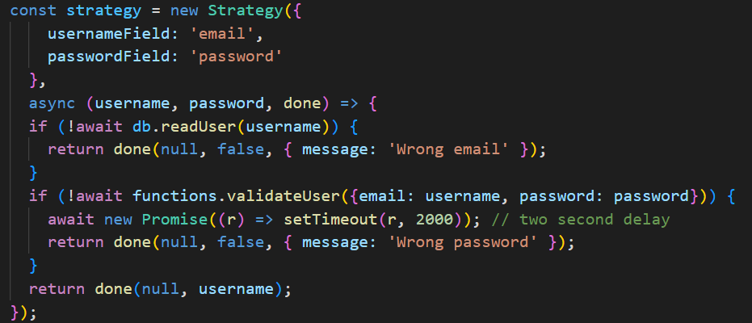
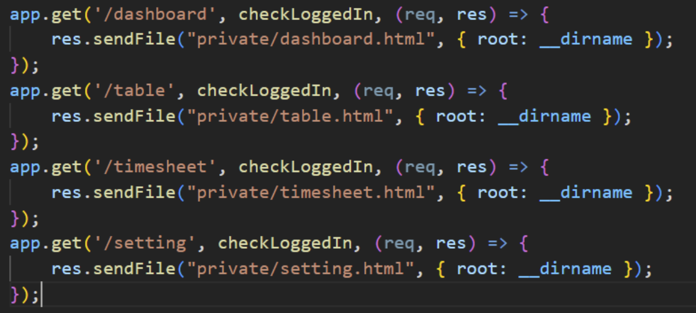

# Title: Copycat
## Subtitle: Admin portal for data management
#### Semester: Spring 2022
### Overview: 
Our project will be focusing on building a data management web application for an existing music player. The potential users of this application are admins, data engineers, and user support. The web application will display the data from the database; the data consists of individual songs and genres. After the data is displayed, the user is able to add, edit, and delete from the corresponding database. Our application is innovative because each of the user’s actions will be recorded and time-stamped, so the user can tell when a given action is performed. All action data will also be displayed to the user in form of graphs and charts, for the purpose of better understanding user activities over a given period of time.

### Team Members:
Team Members | GitHub Usernames
-------------|-----------------
Linhao He 	 |	linhaohe
Zetang Lei	 |	zetangL
Shipeng He	 |	HereAndPeng
Nghia Pham   |  minhnghia2208

## User Interface: 

#### Login Page: 
used to authenticate user
  

#### Register Page: 
  

#### Dashboard:
to see all actions data displayed as a graph 
  

#### Timesheets: to see all actions in detail. User can filter table based on timestamp and export table to pdf file
  

#### Table:
Tables are all dynamically rendered and displayed to the user
  

#### Settings:
Setting user data
  

## Database: 
We use MongoDB for our database. There are three tables: Musics, Users, Actions. 
The Musics table is for storing music data. 
The User table is for storing user info. 
The Actions table stores all of the actions that the user has done  
  

## URL Routes/Mappings AND APIs :
The first 5 are URL routes, the rest are APIs
  

## Authentication/Authorization: 
We use passport js middleware for authentication. The user needs to provide an email and password to authenticate.  
  

Authorization is applied to every endpoint call but /login and /signup. 
  

We have set up roles for authorization in the database. However, there is currently no restriction on access to any roles. 
  

## Division of Labor:

Login: Nghia Pham, Zetang Lei, Linhao He
Dashboard: Zetang Lei
Tables: Shipeng He,  Zetang Lei,  Linhao He
Settings: Linhao He
TimeSheets: Nghia Pham
Database: Nghia Pham, Zetang Lei

## Conclusion: 
Copycat is a complicated project that requires all team members to work together. The project is built using raw HTML, ExpressJS, and MongoDB. As a result, every member of the team has gained significant experience developing web applications using these three technical stacks. 
There are some difficulties encountered. Setting up a code skeleton is one of them as there are many configurations and integrations. Then there were also other difficulties such as implementing logins and able to restrict routing between the pages of the web app. Overall, this project was complicated but we learned a significant amount of web development experience from it.
